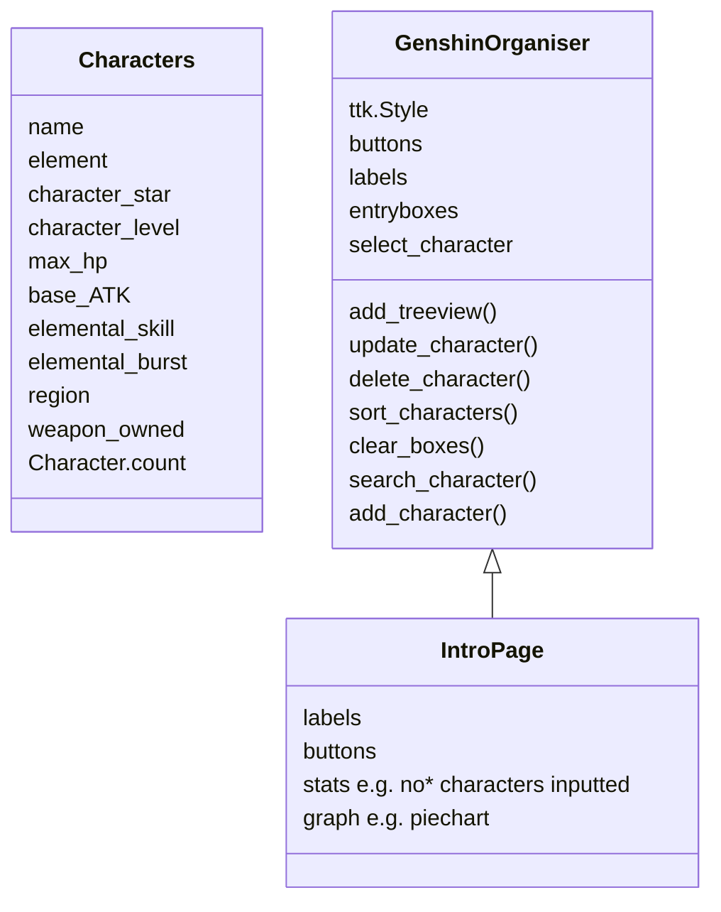

# GenshinCharactersOrganiser

[Trying to check if I can merge changes into main branch]

This project complied all characters that users input from Genshin. This was created and submitted for my final Fundamental of Programming Assignment Year1.

**GENSHIN COLLECTION PROGRAM – BY HAFSA ABDI**

**WHAT IS MY COLLECTION ABOUT?**

My collection is centered around collecting characters a user owns in the Hoyoverse game Genshin. Within this collection, I’ve grouped characters into specific characteristics that I can sort them through. I coded my project in Visual Studio Code so I could return to previous versions using local history if I started experiencing issues. 

If the user doesn’t already have a “genshinCharacter.csv” file, one is made with the 3 characters all Genshin players start with: Amber, Kaeya, and the traveler. I also added Neuvillette because he is my favourite character.  

The challenges I faced as well as the features I hope to implement in the future are detailed in sections below.

I used the following tools in my program: 
Python libraries: csv, tkinter, pandas, os and matplotlib.
UML diagram: I used Mermaid Live Editor to create mine.

**USER REQUIREMENTS**

I based these user requirements on what I thought other people may want to use the app for as well as what I will be using it for.

* As a user, I want to quickly add/update my characters and associated        attributes .
* As a user, I want to be able to access characters I’ve already added.
* As a user, I want to be able to categorise characters e.g. Hydro, Anemo.
* As a user, I want to be able to delete characters.
* As a user I want to be able to sort and filter based on categories and alphabetically .
* As a user, I want to be able to search for characters individually i.e. by name.
* As a user, I want to be able to search through categories such as element and region.
* As a user, I want to able to see a theme.
* As a user, I want to be able to see the total number of characters I own.

#**USER STORIES**

I made some user stories to better understand what others could hope to use my code for.

> **User: Aisha.**
Hi, my name is Aisha!! I want to be able to sort by element to see which character I should pull for!! I also want to be able to sort by strongest character and weakest, so I know who to work on next. I think having a Genshin character theme would be fun as well like my favourite Lyney<3!!

> **User: Darrel**
My name is Darrel! I want to be able to see character weapons and sort by HP and ATK, so I know what artifacts my characters need. I think having a total count for characters would be interesting too!!

**UML DIAGRAMS**

I used mermaid live editor to make a frame for my three classes:

The IntroPage class inherits from the GenshinOrganiser class. The reason why I gave the first page its own class is because I believed it to be cleaner. Page 2 and 3 are incredibly similar (besides the obvious difference in role) whilst page 1 behaves as a sort of dashboard so is coded elsewhere.

**IMPLEMENTATION**

**HOW I WENT ABOUT BUILDING THE CODE**

I took a unique approach with my code and initially only had a character class.
I created the bulk of my functions/methods outside of the class for Tkinter and then put the code in classes because I believed it to be easier especially for debugging.
#**MANUAL TESTING**

| FUNCTION/METHOD                          | REQUIREMENTS                                                                |REQUIREMENTS MET?                                                                |
|-----------------------------------|-----------------------------------------------------------------------------|--------------------------------------------------------------------------------|
| Character.make_characters_csv     | Make a csv file that can be used by the Treeview to populate rows if one doesn’t already exist. | Yes                                                                            |
| GenshinSorter.add_Treeview        | Adds a Treeview table to pages1 and page2.                                    | Mostly: pages have different Treeviews so window needs to be closed and reopened to see changes in page2. |
| GenshinSorter.show_page           | Toggles between pages I created.                                             | Yes                                                                            |
| GenshinSorter.update_character    | Updates the information on a selected existing character ONLY if all boxes are filled. | Yes                                                                            |
| GenshinSorter.delete_character    | Deletes a selected existing character.                                       | Yes                                                                            |
| GenshinSorter.sort_characters     | Sorts characters based on what is in the drop-down menu.                      | Yes                                                                            |
| GenshinSorter.clear_boxes         | Clears all entries in the entry boxes.                                       | Yes                                                                            |
| GenshinSorter.search_character    | Searches for a character in the Treeview based on what was inputted.          | Yes                                                                            |
| GenshinSorter.select_character    | Transfers the information of an existing character into entry boxes for editing. | Yes                                                                            |
| GenshinSorter.add_characters      | Adds a character to the Treeview ONLY if all boxes are filled.                | Yes                                                                            |

**GENERAL PROBLEMS I FACED**

I put my biggest problems and solutions in a table format so I could refer to them whilst coding so if a similar problem occurred, I have a solution that I could implement.

| PROBLEM                                                                                                   | SOLUTION                                                                                                                                                                  |
|-----------------------------------------------------------------------------------------------------------|--------------------------------------------------------------------------------------------------------------------------------------------------------------------------|
| The Tkinter window was not interactive with the window so sometimes things would be outside of the range of the window opened. | Switching from .grid to .pack so that buttons, labels etc. could be placed relative to the size of the window opened.                                                     |
| Struggled to make buttons show up after I switched format from .grid to .pack.                             | I found out that the order of code had a huger effect. I moved the “sort” button and its associated code higher, and the button began to show up.                         |
| Some of my functions connected to my buttons weren't working.                                              | I realised I might have to put the function code before creating the button (this is no longer relevant as I switched to a class format).                                 |
| I struggled with my initial design with my search_character method as a new table would be printed each time. | I solved this by coding the previous table to be deleted every time the search button was pressed.                                                                        |
| Struggled to make the table of characters reflect what happens in the drop-down menu: no change would happen when I selected a drop-down option. | Solved this by creating a “Sort” button to perform this function.                                                                                                         |
| If I add/delete/update a character whilst I'm filtering e.g. for element, then when I add/delete/update I will lose all other characters besides the ones currently being displayed. | Creating ‘pages’ to isolate functions to different pages. I.e. one page to filter and search for characters and another page to add/delete/change characters.             |
| If a user ‘adds’ Or “updates” a character with boxes missing or nothing at all an empty row is added to the Treeview and the csv. | Adding a check to add_character()  and update_character() to make sure all boxes are filled and giving users a warning to remind them to fill all boxes by configuring an empty label for about 5 seconds before it goes blank again. |
| I couldn’t change the color of the Tkinter window because it was tied to my Mac OS, so it was stuck in dark mode. | Using ttk.Style  and then using the style= “clam” was the best solution as clam gives a lot of power to the developer to design so I could finally make the pages blue.    |
| If the character.csv file did not exist already, the graph function could not be executed, nor could the count be executed either causing the page to not open with a file not found error. | I called this Character.make_characters_csv() BEFORE I checked the length of the csv and tried to make the graphs.                                                        |
| Users were able to add letters and non-digits to columns requiring digits e.g. Level.                      | Including a checking point in the update_character() and add_character() method to make sure all columns requiring digits have an isdigit() check.                       |

**USER INTERFACE**

I changed the color scheme to blue so that I have better control over all users experience with my program. Changing the color scheme as well as being careful of where I packed my interactive elements was important as it makes it easier for users to interact with the code and also have a more enjoyable experience.

**HOW TO RUN THE PROJECT**

Open the project in Visual Studio Code. 
Ensure you have the following libraries installed:
*pandas, tkinter, csv, matplotlib*.

To run the program, press the run button on VSCode.

 
**HOW TO USE MY PROJECT**
* There a buttons at the bottom of each page to toggle between pages.
* On page 2, to search for an attribute, enter what you wish to search for in the search box and press search.
* On page 2, to return the treeview search nothing i.e. ""
* On page3, to delete a character select it first.
* When updating a character, make sure that they are the one that is currently selected
* To see changes in the Treeview on page2, close the program and reopen it using the "run" button on VSCode.

**REFLECTIONS**
This was a fun project that taught me a lot about front-end development and back-end development in tandem. I have a couple of ideas for improvement for next time:
*	To replace the element, region and weapon option for editing characters as drop-down menus rather than entry boxes since there's only a fixed number/type of each
*	Adding weapons as a class with attributes as well so that users can see which weapons require levelling up
*	Seeing domains and what days users should go for levelling up characters and weapons
*	Including statues of the seven to see how many more oculus users need to collect 
*	Including a pie chart for weapon input, region input in addition to weapon input and control whether they’re shown via buttons.
*	On Page 2, I want to be able to call bac the whole Treeview without searching “” i.e. nothing using a button
 
